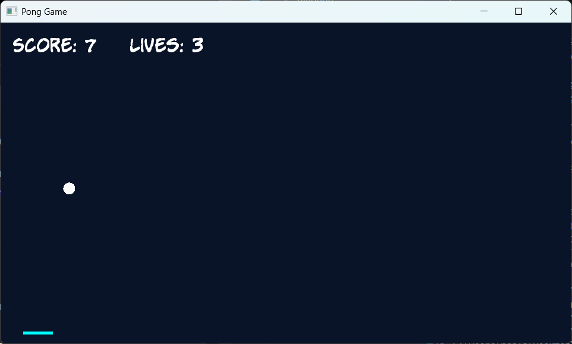
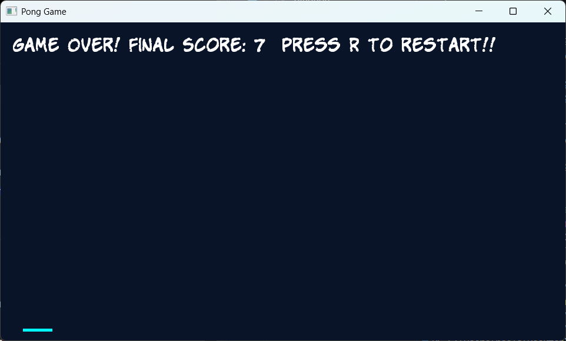

# 🏓 Pong Game (C++ & SFML)

A simple Pong-style arcade game built using **C++** and **SFML**.
Control the bat, keep the ball in play, and try to achieve the highest score before running out of lives.

---

## 🎮 Gameplay

* The player controls a **bat** at the bottom of the screen
* A **ball** bounces around the screen
* Each successful hit increases the **score**
* Missing the ball reduces **lives**
* Game ends when lives reach zero

---

## 🎯 Features

* Smooth real-time gameplay using **SFML**
* Collision detection (ball ↔ walls, ball ↔ bat)
* Score and lives tracking
* Game Over screen with restart option
* Simple and clean UI

---

## 🕹️ Controls

| Key            | Action                         |
| -------------- | ------------------------------ |
| ⬅️ Left Arrow  | Move bat left                  |
| ➡️ Right Arrow | Move bat right                 |
| R              | Restart game (after Game Over) |
| ESC            | Exit game                      |

---

## 🛠️ Technologies Used

* **C++**
* **SFML (Simple and Fast Multimedia Library)**

---

## ⚙️ How to Build and Run

### 1. Install SFML

Download from: https://www.sfml-dev.org/download.php

---

### 2. Compile (Example using g++)

```bash
g++ PongGame.cpp Ball.cpp Bat.cpp -o pong \
-lsfml-graphics -lsfml-window -lsfml-system
```

---

### 3. Run

```bash
./pong
```

> ⚠️ Make sure SFML `.dll` files are present in the same directory when running on Windows.

---

## 📂 Project Structure

```
Pong-Game/
│── PongGame.cpp
│── Ball.cpp
│── Ball.h
│── Bat.cpp
│── Bat.h
│── Fonts/
│── Screenshots/
│── README.md
│── .gitignore
```

---

## 📸 Screenshots

> Add your screenshots in a `screenshots/` folder and update the paths below.

### 🟢 Gameplay



### 🔴 Game Over Screen



---

## 🚀 Future Improvements

* Add sound effects 🔊
* Improve collision physics 🎯
* Add levels or difficulty scaling
* Add pause functionality

---

## 👨‍💻 Author

**Neelakantha Sahu**

---

